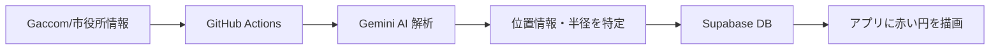

# 🏯 安中・侍の足跡 (Annaka Samurai Footsteps)

[](https://nextjs.org/)
[](https://supabase.com/)
[](https://deepmind.google/technologies/gemini/)
[](https://vercel.com/)

> **「見守る」を「共に歩む」へ。**
> 群馬県安中市。中山道の歴史息づくこの地で、高齢者の散歩を「侍の修行」へと昇華させ、家族に「究極の安心」を届けるデジタル守護プラットフォーム。

---

## 🔗 修行の入り口（デプロイリンク）

どなたでも、安中市の侍としての修行を今すぐ体験いただけます。

*   **🏮 [侍修行アプリ（高齢者用）](https://countryside-project1.vercel.app/)**
    *   修行の開始、侍ランクの確認、凶獣接近アラートを体験。
*   **🏯 [家族見守りアプリ（家族用）](https://countryside-project1.vercel.app/family)**
    *   修行の軌跡、領内の脅威マップ、元気度グラフを確認。

---

## 🗡️ 修行のコンセプト

単なる監視カメラやGPSトラッカーではありません。高齢者が **「修行して領地を守る侍」** となり、家族が **「その活躍を応援する家臣」** となる。デジタル技術によって、孤独な散歩を誇り高き任務へと変革します。

---

## 🌟 珠玉の機能

### 👤 侍修行アプリ（高齢者用）
*   **【真打】筆文字演出（侍フォント）**: `Yuji Syuku` を採用。階級やボタンに魂を宿し、没入感を最大化。
*   **【守護】凶獣接近アラート**: 領内の危険エリア（赤い円）の200m圏内へ侵入した際、画面に「⚠️危険接近」警告が自動発動。
*   **【進捗】中山道・宿場町絵巻**: GPSで正確な移動距離を計測。安中宿から坂本宿までの道のりをリアルタイムで進捗管理。
*   **【診断】帰り際ボイス元気度**: 帰宅時の「ただいま」の声のハリをAIが解析し、元気度を数値化。

### 🏠 家族見守りアプリ（家族用）
*   **【千里眼】領内の脅威マップ**: AIが自動検知した凶獣（クマ・イノシシ）の出没エリアを可視化。
*   **【整理】修行絵巻アコーディオン**: 履歴をスッキリ整理。最新3件以外を折りたたむことで地図へのアクセスを最速化。
*   **【精度】侍領内ロジック**: 番地住所に加え、「安中宿付近」「高崎方面（遠征中）」など、侍としての居場所を独自判定。

---

## 🛡️ 千里眼システム（自動情報同期）

本システムは、GitHub ActionsとGemini AIを連携させた**「24時間自動防衛網」**です。



1.  **Crawler**: 1時間おきに領内のニュースを自動巡回。
2.  **AI Parsing**: Gemini 1.5 Flashが文章から住所を読み取り、座標データへ変換。
3.  **Realtime**: 解析された危険箇所は、即座に全ユーザーの地図へ反映。

---

## 🔧 技術の結晶

| 分類 | 技術 |
| :--- | :--- |
| **Frontend** | Next.js 14, Tailwind CSS, Framer Motion |
| **Intelligence** | Gemini 1.5 Flash, Google Maps API |
| **Infrastructure** | Supabase, GitHub Actions, Vercel |
| **Font** | Yuji Syuku (Google Fonts) |

---

## 🚀 開発の軌跡 (2026/03/19 更新)

*   **DONE**: 24時間自動同期システム（千里眼）の稼働開始
*   **DONE**: 筆文字フォントによるUIテーマの全面刷新
*   **DONE**: 野生動物接近検知・警告UIの実装
*   **DONE**: 家族画面の履歴折りたたみ機能の導入

---

## 🛠️ クイックスタート

```bash
# クローン
git clone https://github.com/WaRara-men/countryside-project1.git

# セットアップ
npm install

# 開発サーバー起動
npm run dev
```

© 2026 安中・侍の足跡 開発チーム | [安中市公式サイト](https://www.city.annaka.lg.jp/)
